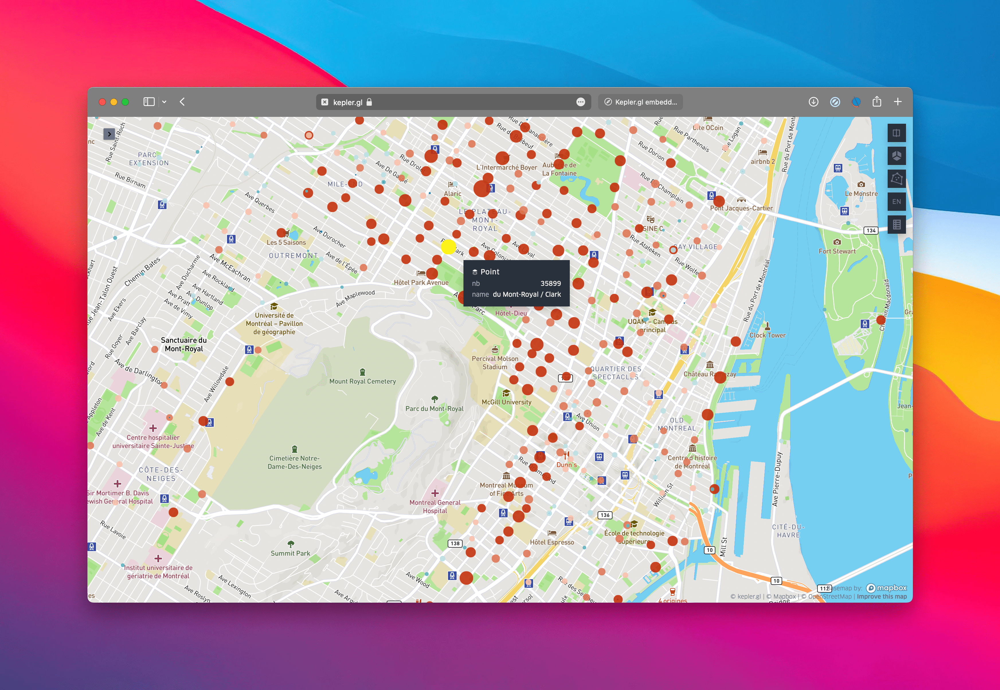

# Hello Montreal ! 
The goal of this project is to help Montrealers who use Bixi (a fantastic way to get around in Montreal). 


This project is part of one course of my studies of Master in Science in Ecole Technologie Superieur of Montreal.

I hope this app will help you to move in Montreal.

Feel free to reuse my code ! ;)  
Lucas


# Documentation
I realise this documentation with [Sphinx](https://www.sphinx-doc.org/en/master/). 
For generate the documentation, placez vous dans le dossier **bixi_montreal_visu** puis : 
```
sphinx-apidoc -o . ../  
```
This will create, the *rst files*.  
You can after execute a `make html` to generate the documentation. 


# How it works

## The data
This code works with several data, first i use the data available on the website of [bixi](https://bixi.com/fr/donnees-ouvertes).

I use this data to produce a first analysis and visualization. With this first analysis, we were able to build a map of the most used stations.   
We first use the online version of Kepler.gl to produce this maps due to his first implementations.

This helped us to see several errors in the dataset such as station location problems.  
For instance, the **Smith / Peel** stations hadn't the right coordinate. I mail Bixi but no response from them :( (December 2022).


Then, I use the Montreal GBFS data.
GBFS stands for General Bikeshare Feed Specification, is a standardized data format for bikeshare information. It is used to provide real-time information about bikeshare systems, such as the availability of bikes and docks at specific locations, pricing, and station locations. This information is typically made available to the public through an API (Application Programming Interface) that can be accessed by developers, who can then use the data to create apps or other tools that help users find and use bikeshare systems.

This GBFS data are available at [this url](https://gbfs.velobixi.com/gbfs/gbfs.json). 


